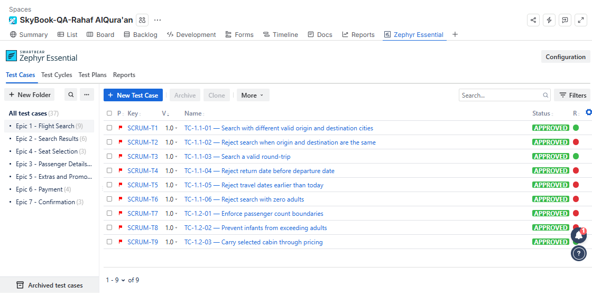
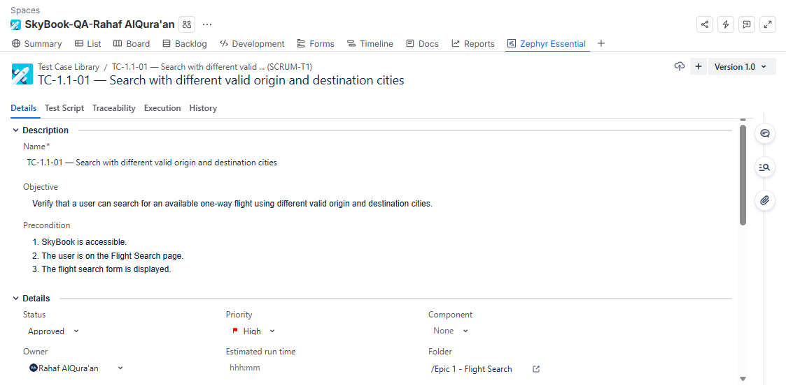
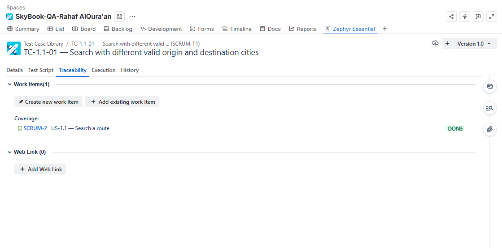
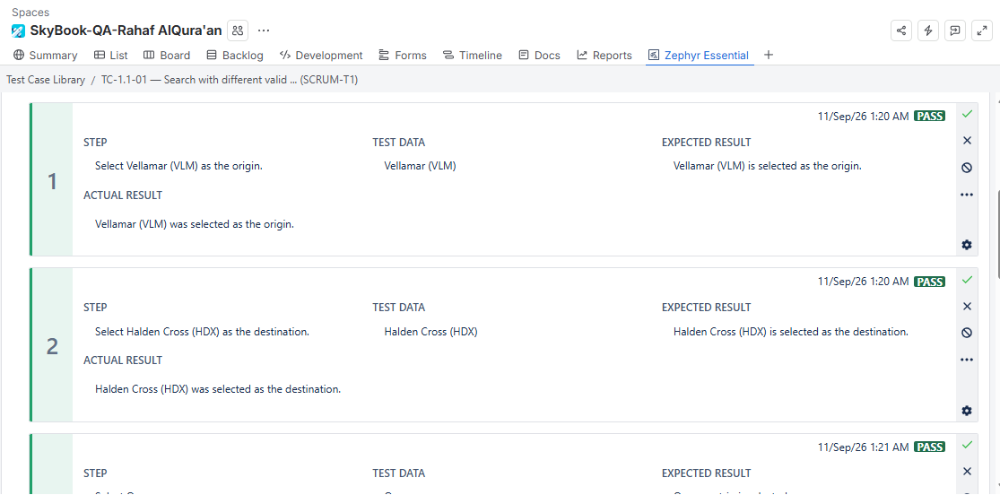
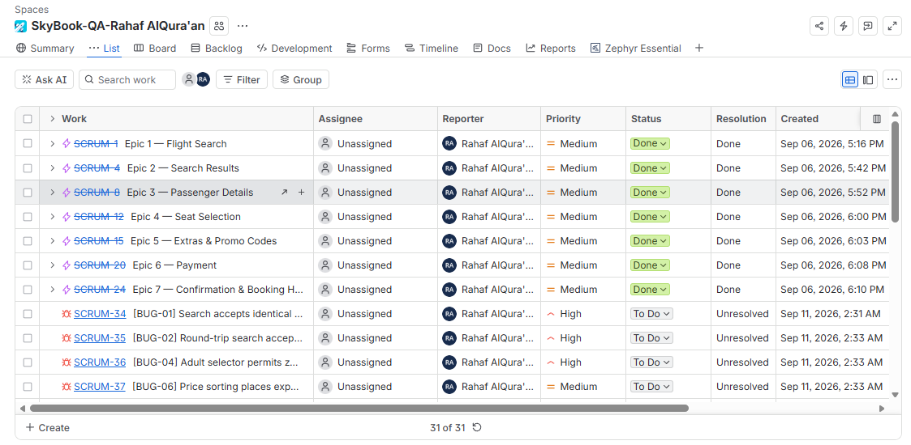
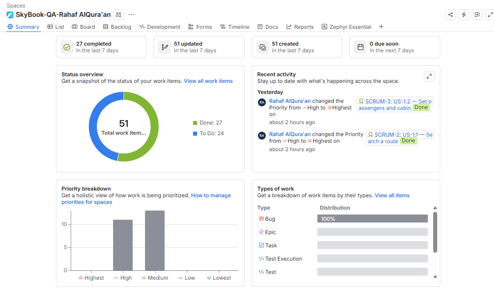
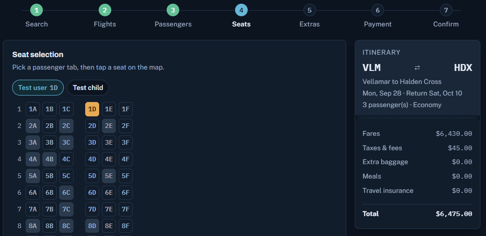
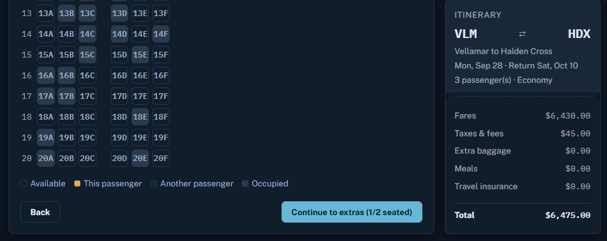

# SkyBook Manual QA Project

End-to-end manual QA project for the SkyBook practice flight-booking application. The project demonstrates requirements analysis, test design, execution, defect reporting, and full traceability in Jira and Zephyr Essential.

## Project Overview

- **Author:** Rahaf AlQura'an
- **Application under test:** [SkyBook Practice Booking](https://claude.ai/code/artifact/5028f8a7-4747-4b7e-b07f-a4dddf65807c)
- **Tools:** Jira, Zephyr Essential, CSV, Excel
- **Testing type:** Manual functional, negative, boundary, and end-to-end testing
- **Execution date:** 7 September 2026

## Results

| Metric | Count |
| --- | ---: |
| Test cases | 37 |
| Passed | 16 |
| Failed | 20 |
| Blocked | 1 |
| Bugs reported | 24 |

The blocked case, TC-6.3-01, could verify the displayed arithmetic but could not verify child-fare and tax-scaling rules because the UI did not expose the required calculation details.

## Highlights

- Built coverage across 7 Epics and 20 User Stories.
- Documented every case with preconditions, exact test data, execution steps, expected result, actual result, and status.
- Reported 24 observable defects and linked failed tests to their affected requirements.
- Created an Epic → Story → Test Case → Bug traceability chain.
- Kept observed behavior separate from assumptions about implementation.

## Repository Contents

- [Test plan](docs/TEST_PLAN.md)
- [Complete execution report](docs/EXECUTION_REPORT.md)
- [Detailed bug reports](docs/BUG_REPORTS.md)
- [Traceability matrix](docs/TRACEABILITY.md)
- [Test cases in CSV](test-cases/SkyBook_Test_Cases.csv)
- [Bug reports in CSV](bugs/SkyBook_Bug_Reports.csv)
- [Traceability matrix in CSV](traceability/SkyBook_Traceability_Matrix.csv)
- [QA project workbook](SkyBook_QA_Project.xlsx)
- [Screenshot checklist](screenshots/README.md)

## Selected Findings

- Search accepted identical origin and destination cities.
- Date validation accepted invalid and past travel dates.
- Passenger validation accepted zero adults and more infants than adults.
- Price sorting and the nonstop filter returned incorrect results.
- Passenger, passport, payment, CVV, and terms validations had multiple gaps.
- Duplicate seat assignment, negative baggage, and repeated promo discounts were possible.
- Starting a new booking retained previous trip selections.

## Jira Evidence

Jira and Zephyr screenshots can be added to the `screenshots/` folder. The live Jira project URL is omitted from the public repository for privacy.

## Screenshots

### Zephyr Test Case Library

The test library contains 37 approved test cases organized into folders that match the seven project Epics.

### Test Case Definition

Each test case documents its objective, preconditions, priority, owner, and Epic-based folder organization.

### Requirement Traceability

Zephyr coverage links each test case to the Jira Story it verifies.

### Step-by-Step Test Execution

Execution evidence records each step separately with test data, expected result, actual result, timestamp, and status.

### Jira Epics and Bugs

The Jira work-item view shows the seven completed Epics and the reported defects with their priorities and workflow status.

### Jira Project Summary

The project summary shows 51 work items: 27 completed requirements and 24 open defects.

### BUG-14 — Seat Completion Validation

The booking contains two seat-holding passengers, while only the first passenger has seat 1D assigned.

Despite the counter showing `1/2 seated`, the **Continue to extras** button is enabled. It should remain disabled until every seat-holding passenger has an assigned seat.

## Notes

SkyBook is a fictional practice environment. No real payment was processed and all identity data used during testing was synthetic.
